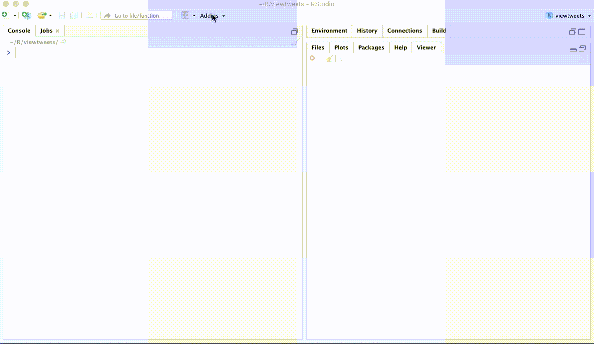

<!-- README.md is generated from README.Rmd. Please edit that file -->

# viewtweets 

<!--[](https://travis-ci.org/mkearney/viewtweets)
[](https://cran.r-project.org/package=viewtweets)
[](https://codecov.io/gh/mkearney/viewtweets?branch=master)

#
#-->

[](https://www.tidyverse.org/lifecycle/#experimental)

View Twitter timelines in Rstudio.

## Installation

Install the development version from Github with:

``` r
## install remotes pkg if not already
if (!requireNamespace("remotes")) {
  install.packages("remotes")
}

## install from github
remotes::install_github("mkearney/viewtweets")
```

## View home timeline

View home (authenticating user’s) timeline:

<p style="align:center">


</p>

## View user timeline

View tweets posted by a given user:

<p style="align:center">



</p>
